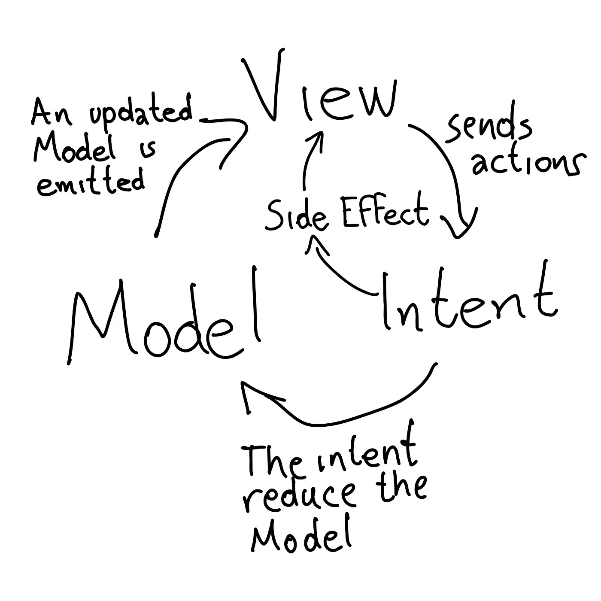

# AwesomeLogin

AwesomeLogin is a demo app intended to showcase [MAD (Modern Android Development)](https://developer.android.com/series/mad-skills).

## Demo

https://github.com/jesusdmedinac/AwesomeLogin/assets/9106910/9c7ad78d-01ff-4404-883b-fa5a85be1816

## UML

A big picture of a general login can be found on the next set of diagrams that represent the
intention behind implementing a login/signup flow in many apps.

### App - Use Cases


### Home - Sequence Diagram


### Login - Sequence Diagram


## Feature-Oriented Architecture

Adopting Clean Architecture at the feature level can be a powerful approach, especially in large and complex software projects. This approach is sometimes referred to as Feature-Oriented Architecture or Feature Modules.

The project structure is defined next:

```
- core
  - mapper
- feature
  - data
    - repository
    - remote
    - local
    - model
  - domain
    - repository
    - usecase
    - model
  - presentation
    - compose
    - model
```

## [Mapping Data between layers](https://blog.jesusdmedinac.com/mapping-data-between-layers-db8ad93f0f8f)

I fully explain this pattern on the article attached in the title. I'm using in this project a simple class implementation for mapping data between layers.

## [MVI Presentation Pattern](https://blog.jesusdmedinac.com/mvvm-vs-mvi-for-jetpack-compose-e7e5e2f11e0b)

The main differences between MVVM and MVI is that MVI add the concept of unidirectional flow. It means that the View is updated by the updates on the Model that are produced by Intents:
The UI sends actions asynchronously to a business component.

The Intent transforms the incoming actions with business logic.
The Intent then emits these actions further down the chain.
Every action is reduced with the current Model of the system to produce a new Model
The updated Model is then emitted back to the UI which renders itself based upon information within.



## Tech Stack

- [Kotlin](https://kotlinlang.org/) - 100% of the project was writte in Kotlin.
- [JUnit4](https://junit.org/junit4/) - Unit and Instrumented tests.
- [Voyager](https://voyager.adriel.cafe/) - Multiplatform Compose Navigation.
- [Jetpack Compose](https://developer.android.com/develop/ui/compose) - Declarative UI framework for Android development.
- [Orbit MVI](https://orbit-mvi.org/) - MVI Framework to support unidirectional data flow taking advantage of [Kotlin Coroutines](https://kotlinlang.org/docs/coroutines-overview.html) and [Kotlin Flows](https://developer.android.com/kotlin/flow?hl=es-419)
- [Insert Koin](https://insert-koin.io/) - Dependency injection tools 100% written in Kotlin. It support annotations usage with [KSP](https://github.com/google/ksp)
- [Mockk](https://mockk.io/) - Mock library 100% written in Kotlin. It support Kotlin Coroutines, static and extension functions mocks, and more Kotlin features.
- [Lottie Compose](https://airbnb.design/lottie/) - Artistic custom animations developed by Airbnb